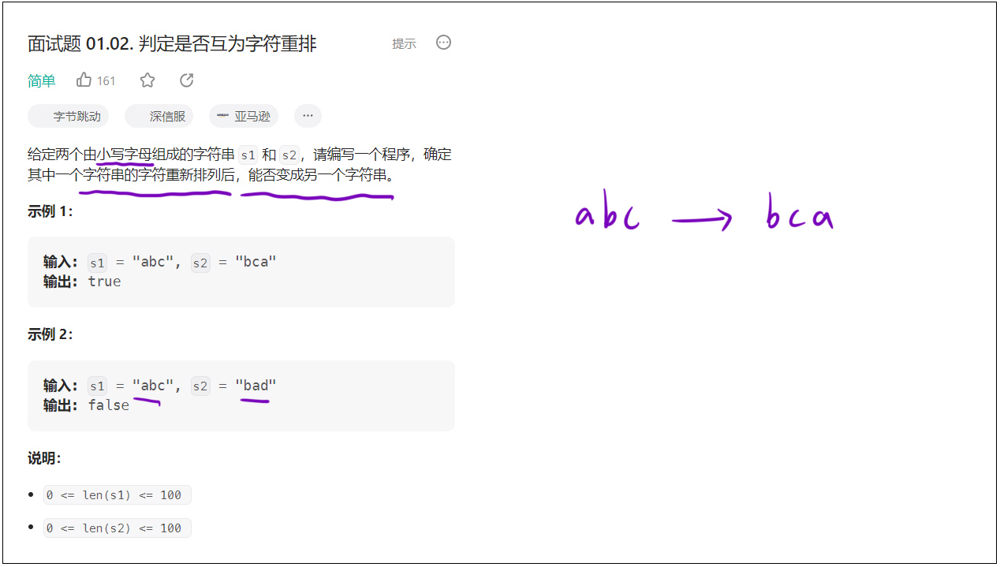
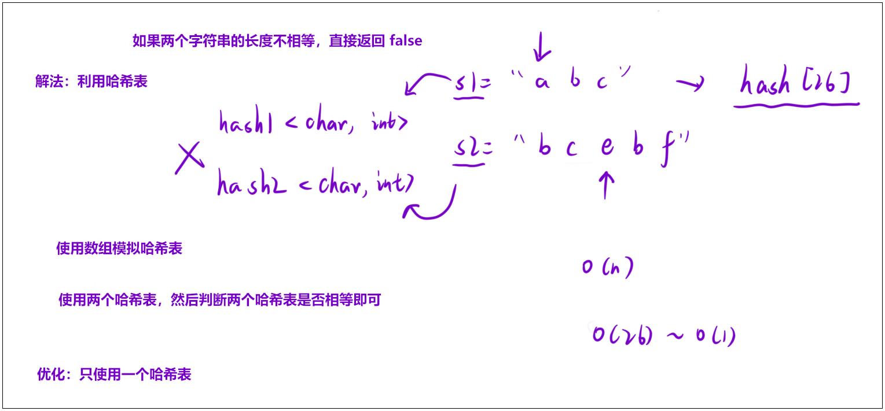

### 1. 题目链接

[面试题 01.02. 判定是否互为字符重排](https://leetcode.cn/problems/check-permutation-lcci/description/)


**如下图所示：**




### 2. 解法（哈希表）

**算法思路:**
- 当两个字符串的长度不相等的时候，是不可能构成互相重排的，直接返回 **false**；
- 如果两个字符串能够构成互相重排，那么每个字符串中「各个字符」出现的「次数」一定是相同的。因此，我们可以分别统计出这两个字符串中各个字符出现的次数，然后逐个比较是否相等即可。这样的话，我们就可以选择「哈希表」来统计字符串中字符出现的次数。


**如下图所示：**




### 3. 算法代码


```cpp
class Solution 
{
    // 定义一个长度为26的哈希数组，对应26个小写英文字母，初始值都为0
    // 用于统计每个字符出现的次数
    int hash[26] = { 0 };
public:
    // 函数功能：判断s1的字符重新排列后能否变成s2
    bool CheckPermutation(string s1, string s2) 
    {
        // 字符串长度不相等, 字符数量不同，不可能互为重排，直接返回false
        if (s1.size() != s2.size()) return false;

        // 遍历第一个字符串s1，统计每个字符出现的次数
        // const auto &ch 表示只读遍历s1的每个字符，避免拷贝提升效率
        for (const auto &ch : s1)
        {
            // ch - 'a' 将字符转换为0-25的索引（如'a'->0, 'b'->1...）
            // 对应位置的计数加1，记录该字符出现次数
            hash[ch - 'a']++;
        }

        // 遍历第二个字符串s2，抵消对应字符的计数
        for (const auto &ch : s2)
        {
            // 对应字符的计数减1
            hash[ch - 'a']--;
            // 如果计数小于0，说明s2中该字符数量多于s1，无法重排，直接返回false
            if (hash[ch - 'a'] < 0) return false;
        }
        // 所有字符计数都能抵消为0，说明字符种类和数量完全一致，返回true
        return true;
    }
};
```

**总结：**
- 通过长度校验快速排除不可能的情况，再用哈希数组统计字符出现次数，通过计数抵消的方式验证字符种类和数量是否完全一致。
- `ch - 'a'` 将字符映射为0-25的数组索引，是处理小写字母统计的经典技巧；计数小于0时立即返回false，提前终止无效遍历。
- 时间复杂度为O(n)（n为字符串长度），仅需两次线性遍历；空间复杂度为O(1)，哈希数组长度固定为26，不随输入规模变化。
