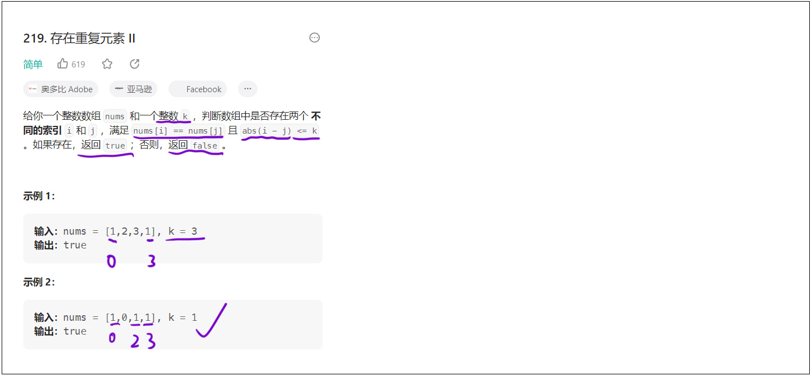
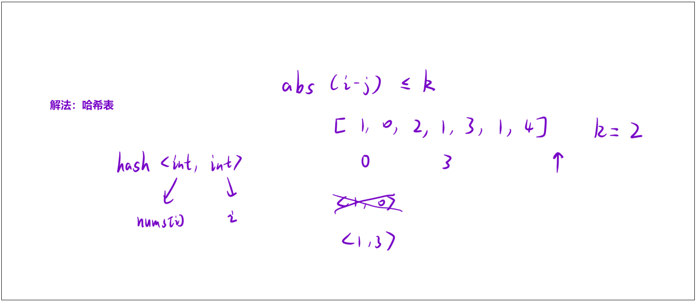

### 1. 题目链接

[219. 存在重复元素 II](https://leetcode.cn/problems/contains-duplicate-ii/description/)

**如下图所示：**




### 2. 解法（哈希表）

**算法思路：**

解决该问题需要我们快速定位到两个信息：
- 两个相同的元素；
- 这两个相同元素的下标。

因此，我们可以使用「哈希表」，令数组内的元素做 key 值，该元素所对应的下标做 val 值，将「数组元素」和「下标」绑定在一起，存入到「哈希表」中。


**如下图所示：**




**思考题：**

如果数组内存在大量的「重复元素」，而我们判断下标所对应的元素是否符合条件的时候，需要将不同下标的元素作比较，怎么处理这个情况呢？

答：这里运用了一个「小贪心」。

我们按照下标「从小到大」的顺序遍历数组，当遇到两个元素相同，并且比较它们的下标时，这两个下标一定是距离最近的，因为：
- 如果当前判断符合条件直接返回 true，无需继续往后查找。
- 如果不符合条件，那么前一个下标一定不可能与后续相同元素的下标匹配（因为下标在逐渐变大），那么我们可以大胆舍去前一个存储的下标，转而将其换成新的下标，继续匹配。


### 3. 算法代码

```cpp
class Solution 
{
public:
    bool containsNearbyDuplicate(vector<int>& nums, int k) 
    {
        // 哈希表：键-数组元素值，值-该元素最后一次出现的索引
        unordered_map<int, int> hash;
        
        // 遍历数组，逐个检查当前元素
        for (int i = 0; i < nums.size(); i++)
        {
            // 检查当前元素是否已经在哈希表中存在（即之前出现过）
            if (hash.count(nums[i]))
            {
                // 获取该元素上一次出现的索引j
                int j = hash[nums[i]];
                // 判断两个索引的差值绝对值是否小于等于k，满足则直接返回true
                if (abs(j - i) <= k) return true;
            }
            // 核心逻辑：无论当前元素是否出现过，都更新为最新的索引
            // 这样可以保证后续遇到相同元素时，比较的是最近的一次出现位置，减少无效判断
            hash[nums[i]] = i;
        }
        
        // 遍历结束未找到满足条件的元素对，返回false
        return false;
    }
};
```

**总结：**
- 使用哈希表记录每个元素 **最后一次出现的索引**，遍历数组时只需和最近一次出现的位置比较，保证效率。
- 每次遍历元素时，先检查是否存在于哈希表，若存在则判断索引差；无论是否满足条件，都更新该元素的索引为当前值。
- 时间复杂度为O(n)（仅遍历一次数组），空间复杂度为O(n)（最坏情况哈希表存储所有元素）。