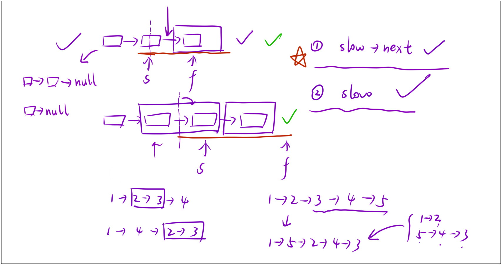

### 1. 题目链接

[143. 重排链表](https://leetcode.cn/problems/reorder-list/description/)

**如下图所示：**


### 2. 解法

**算法思路：**
- step 1：找中间节点；
- step 2：中间部分往后进行逆序；
- step 3：合并两个链表。


**如下图所示：**


### 3. 算法代码

我们需要逆序的是中间节点的后半段：



代码如下：
```cpp
/**
 * Definition for singly-linked list.
 * struct ListNode {
 *     int val;          // 节点存储的值
 *     ListNode *next;  // 指向下一个节点的指针
 *     ListNode() : val(0), next(nullptr) {}                     // 默认构造函数
 *     ListNode(int x) : val(x), next(nullptr) {}                // 带值构造函数
 *     ListNode(int x, ListNode *next) : val(x), next(next) {}   // 带值和下一个节点的构造函数
 * };
 */
class Solution 
{
public:
    void reorderList(ListNode* head) 
    {
        // 0. 处理边界情况：空链表、只有1个节点、只有2个节点，无需重排直接返回
        if (head == nullptr || head->next == nullptr || head->next->next == nullptr) return;

        // 1. 找到链表的中间结点 - 快慢双指针法（快指针走两步，慢指针走一步）
        // 核心逻辑：快指针遍历完链表时，慢指针刚好走到链表中间位置
        ListNode* slow = head, *fast = head;
        while (fast && fast->next)  // 循环条件：快指针未到末尾且下一个节点存在
        {
            slow = slow->next;       // 慢指针每次走1步
            fast = fast->next->next;// 快指针每次走2步
        }

        // 关键说明：
        // - 奇数长度链表：slow指向正中间节点（如1->2->3->4->5，slow指向3）
        // - 偶数长度链表：slow指向中间偏右节点（如1->2->3->4，slow指向3）
        // 统一从slow的下一个节点断开链表，对后半部分逆序

        // 2. 把 slow 后面的链表部分逆序 - 头插法（构建新的反转链表）
        ListNode* head2 = new ListNode(0); // 虚拟头节点，方便头插法操作
        ListNode* cur = slow->next;        // cur指向后半段链表的第一个节点
        slow->next = nullptr;              // 切断原链表，分成前半段(head)和后半段(cur)

        // 头插法逆序后半段链表：每次把当前节点插入到虚拟头节点后，实现反转
        while (cur)
        {
            ListNode* next = cur->next;    // 保存当前节点的下一个节点（防止断链）
            cur->next = head2->next;       // 当前节点指向虚拟头节点的下一个节点
            head2->next = cur;             // 虚拟头节点指向当前节点（完成头插）
            cur = next;                    // cur移动到下一个待处理节点
        }

        // 3. 合并两个链表（前半段head + 逆序后的后半段head2->next）- 双指针尾插法
        ListNode* ret = new ListNode(0);   // 虚拟头节点，用于合并结果的暂存
        ListNode* prev = ret;              // prev指针：始终指向合并链表的尾部，用于尾插
        ListNode* cur1 = head, *cur2 = head2->next; // cur1遍历前半段，cur2遍历逆序后的后半段

        while (cur1) // 循环条件：前半段未遍历完（前半段长度 ≥ 后半段）
        {
            // 第一步：插入前半段的当前节点
            prev->next = cur1;    // 尾部指向当前cur1节点
            cur1 = cur1->next;     // cur1后移一位
            prev = prev->next;     // 尾部指针后移一位

            // 第二步：如果后半段还有节点，插入后半段的当前节点
            if (cur2)
            {
                prev->next = cur2; // 尾部指向当前cur2节点
                cur2 = cur2->next; // cur2后移一位
                prev = prev->next; // 尾部指针后移一位
            }
        }

        // 释放临时创建的虚拟头节点，避免内存泄漏
        delete head2;
        delete ret;
    }
};
```


**这段代码的核心解题思路分为3个关键步骤：**
- 通过快慢双指针定位链表中点，将链表切分为前半段（`L0→L1→…→Lmid`）和后半段（`Lmid+1→…→Ln`）；
- 用头插法反转后半段链表，得到 `Ln→Ln-1→…→Lmid+1`；
- 交替拼接前半段和逆序后的后半段，最终得到 `L0→Ln→L1→Ln-1→…`` 的结果。

**额外注意点：**
- 处理了边界情况（节点数≤2时直接返回）；
- 合并时保证前半段优先（因为前半段长度≥后半段）；
- 释放了临时创建的虚拟头节点，避免内存泄漏。